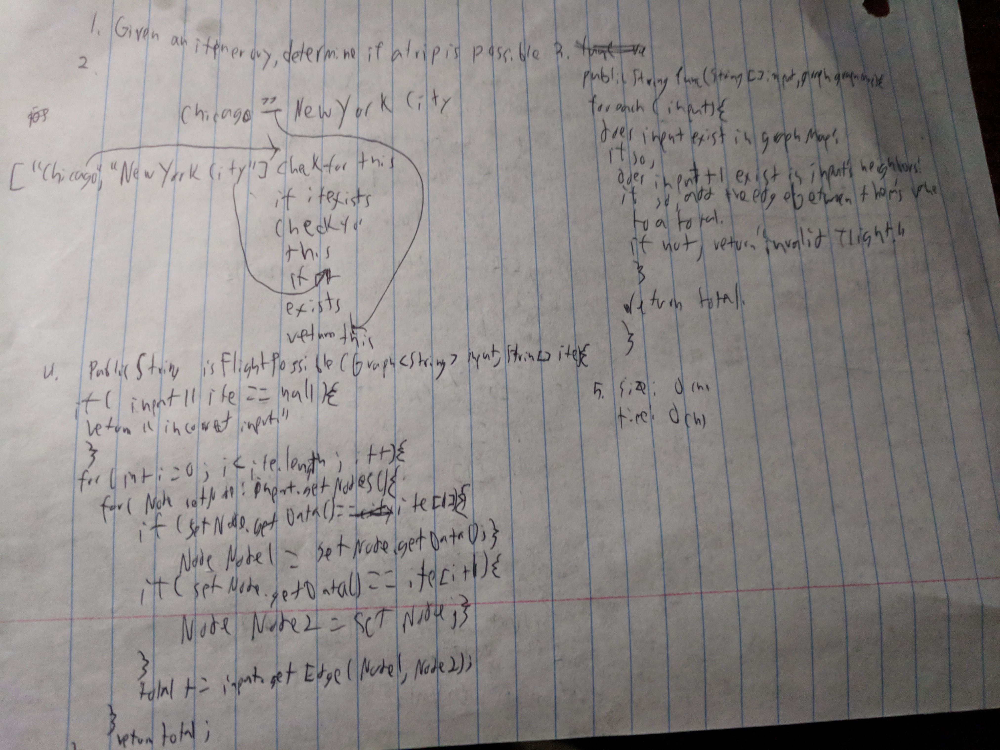

# Find Edge
Find if an edge exists in a graph.

## Challenge
Take in an array of strings and see if you can navigate through the graph from the first all the way to the last. returning the cost if you can.

## Solution
